# Atividade 2

## Propósito da atividade

O texto abaixo descreve o propósito e os requisitos da atividade:

```text
- Com uso de linha de comando padrão do Mininet, crie a
topologia customizada considerando o endereço MAC
padronizado e controlador manual;
- Inspecione informações das interfaces, endereços MAC, IP e
portas através de linhas de comando;
- Crie um desenho ilustrativo da topologia com todas as
informações obtidas no item anterior;
- Faça testes de ping considerando os switches normais;
- Apague as regras anteriores e crie regras baseadas em
endereços MAC para alguns nós. (Deve-se comunicar hosts
dos diferentes switches);
- Faça testes de ping para demonstrar que as regras foram bem 
implementadas
```

Topologia customizada requerida pela atividade

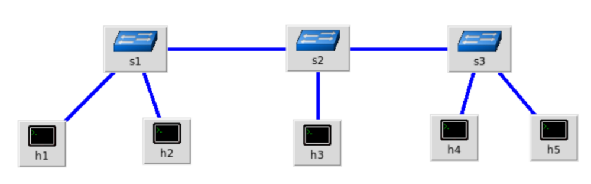

## 1 - Código da topologia

O código abaixo abaixo pode ser encontrado nesse projeto. Está localizado em [custom_topo.py](custom_topo.py)

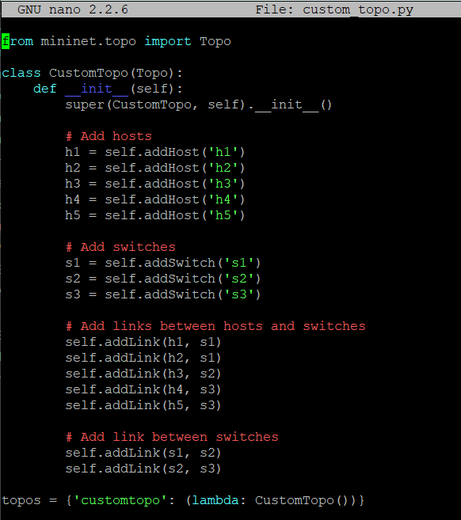

## 2 - Criar a topologia

```bash
sudo mn --custom custom_topo.py --topo customtopo
```

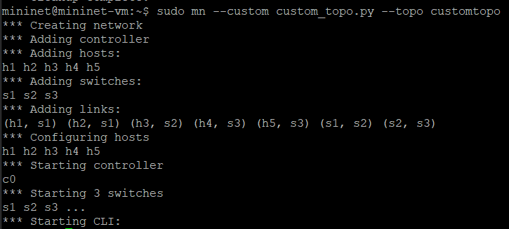

### 3 - Inspeção das interfaces, endereços MAC, IP e portas

#### Listar nós, mostrar a topologia e links e ostrar tabela resumida (hosts, switches, interfaces)

```bash
nodes
net
dump
host/switch ifconfig -a
```

#### Nós da topoliga

## 

#### Rede da topologia

## 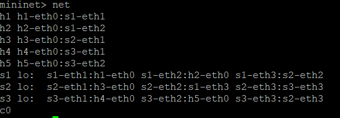

#### Endereço das portas lógicas

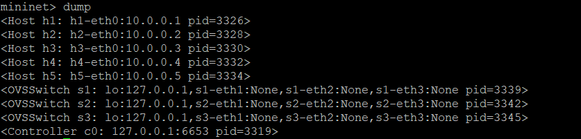

#### Host data

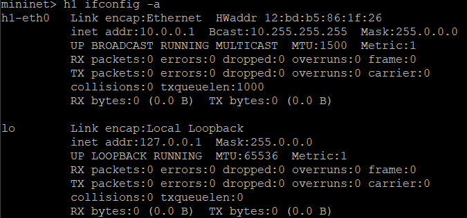
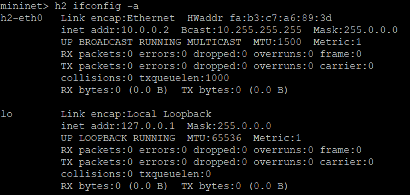
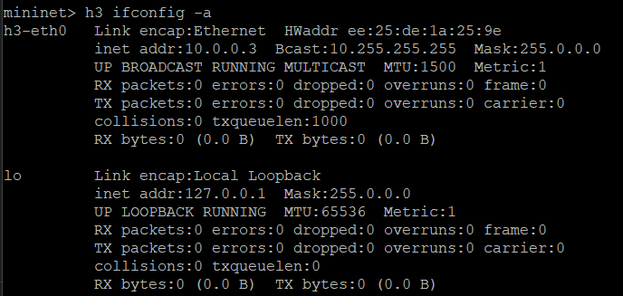

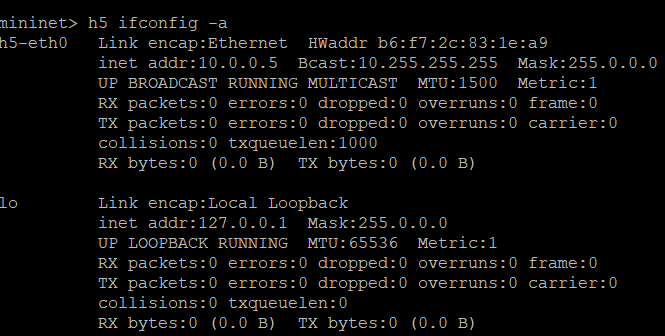

### 4 - Desenho ilustrativo da topologia

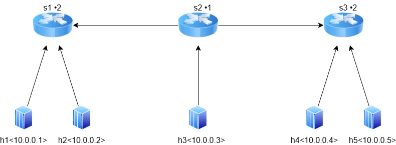

### 5 - Teste de ping

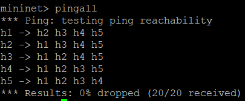

### 5 - Recriar Regras

#### Deletar regras existentes

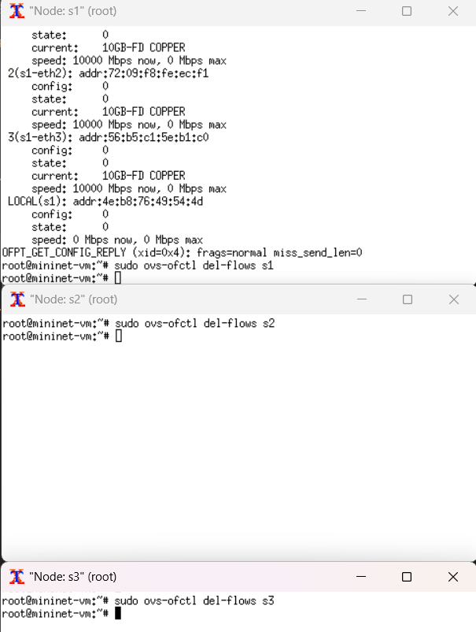

#### Criar regras para comunicação h1-h4

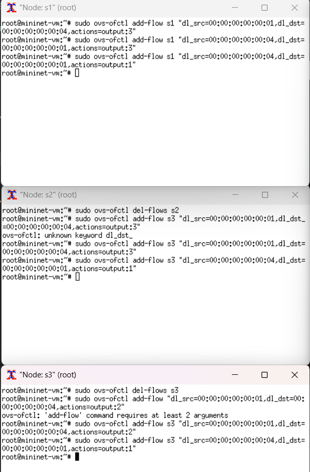

#### Teste de ping para as novas regras

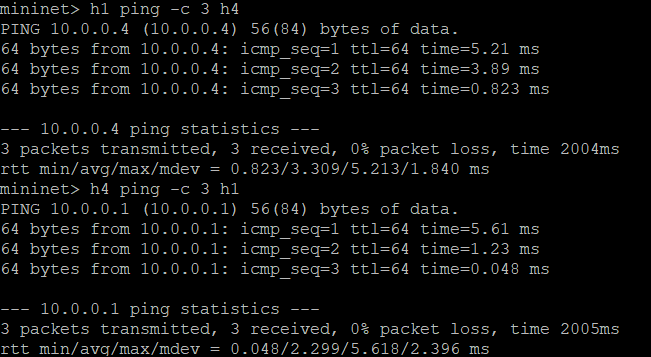
