# Trabalho Mininet - C115

## Diego Nogueira Rezende Vilela - 1988

### 1. Introdução

Este trabalho tem como objetivo explorar conceitos fundamentais de redes definidas por software (SDN) e o uso do Mininet para simulação de topologias de rede virtuais. Foi desenvolvida e testada uma topologia linear composta por seis switches interligados, cada um associado a um host, de modo a representar uma sequência de enlaces com largura de banda controlada.

O ambiente de execução foi configurado em uma máquina virtual no VirtualBox, utilizando o Xming para suporte gráfico e o PuTTY para acesso remoto via terminal SSH. Essa combinação de ferramentas possibilitou a criação e o controle do ambiente de rede de forma isolada e reprodutível.

Durante a atividade, foram aplicados comandos básicos do Mininet para:

- Construção da topologia linear com seis switches e largura de banda de 25 Mbps em cada enlace;

- Inspeção de interfaces de rede, incluindo endereços MAC, IP e portas dos switches;

- Execução de testes de conectividade (ping) entre diferentes nós da topologia;

- Configuração de um servidor e cliente TCP, utilizando o iperf para mensurar o desempenho da rede com relatórios de throughput a cada segundo durante 15 segundos de teste.

Com isso, o experimento proporcionou uma visão prática sobre a operação e monitoramento de redes virtuais, o comportamento de enlaces com largura de banda limitada e a interação entre diferentes nós sob o controle de um controlador padrão do Mininet.

### 2. Instruções

Considere uma topologia linear com 6 switchs.

- Com uso de linha de comando padrão do Mininet, crie a topologia considerando o endereço MAC padronizado, larguras de banda bw de 25Mbps e controlador do Mininet (não precisa especificar);
- Inspecione informações das interfaces, endereços MAC, IP e portas através de linhas de comando;
- Execute testes de ping entre os diferentes nós.
- Especifique que o host 1 na porta 5555 vai ser um servidor TCP e o host 2 um cliente e execute testes de iperf, considere um relatório por segundo com teste de 15 segundos.

### 2. Criação da topoligia

```bash
sudo mn --topo=linear,6 --mac --link tc, bw=25
```

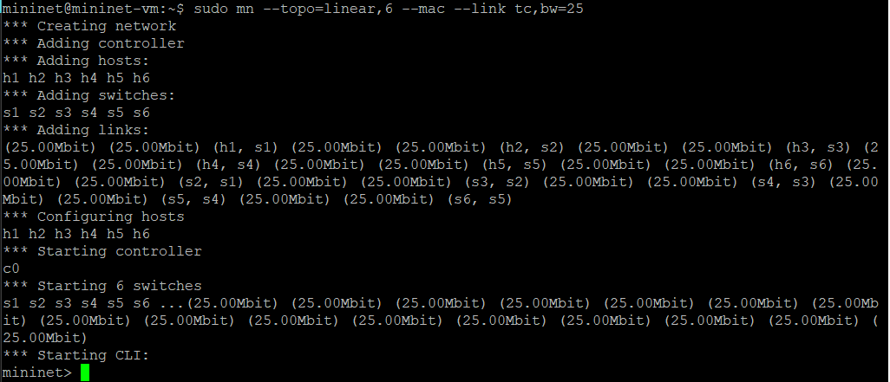

### 3. Inspeção das interfaces, endereços MAC, IP e portas

#### Listar nós, mostrar a topologia e links e ostrar tabela resumida (hosts, switches, interfaces)

```bash
nodes
net
dump
```

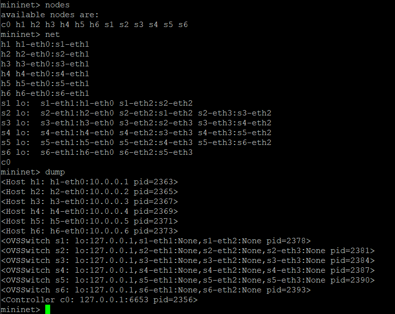

#### Inspecionar endereços (h1 - h6)

```bash
h1 ifconfig
```

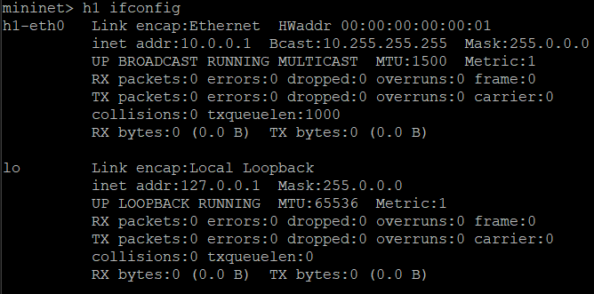

```bash
h2 ifconfig
```

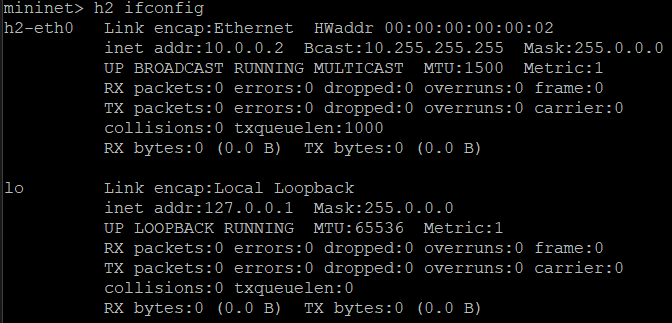

```bash
h3 ifconfig
```

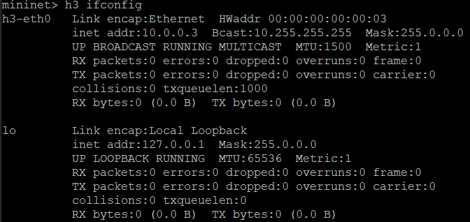

```bash
h4 ifconfig
```


```bash
h5 ifconfig
```

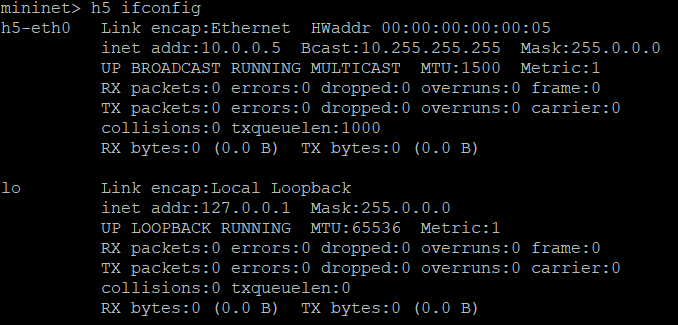

```bash
h6 ifconfig
```

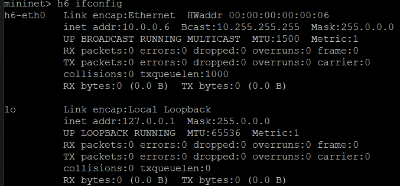

#### Inspecionar switch (todos verificados mas print apenas de s1)

```bash
s1 ifconfig
```

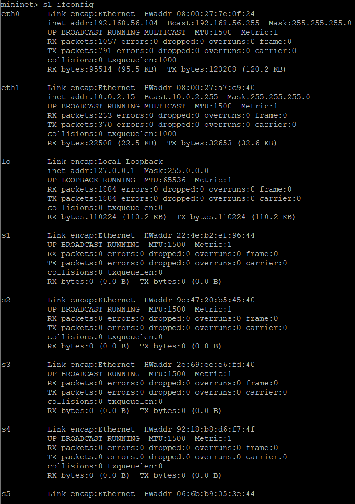
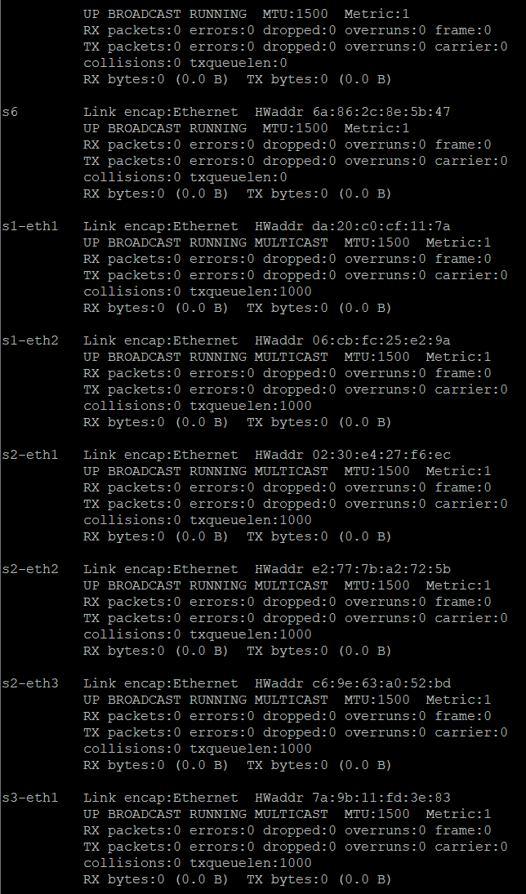
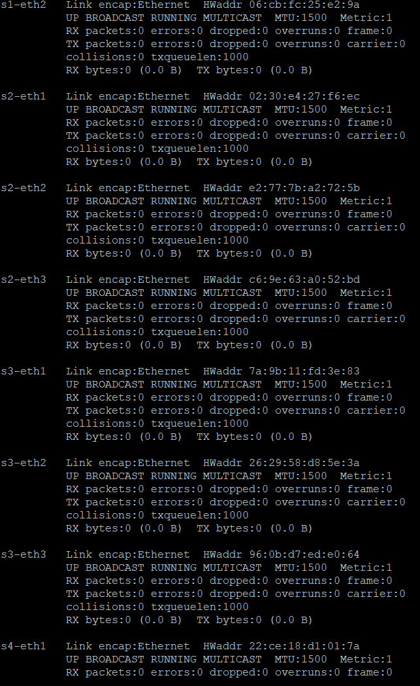
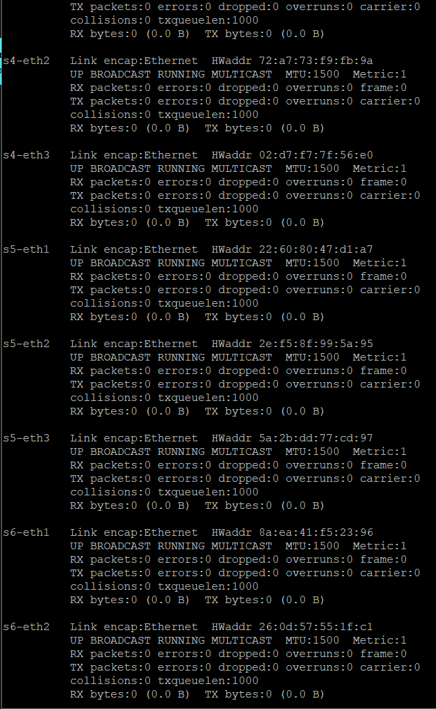

### 4. Pings entre diferentes nós

#### Ping entre todos

```bash
pingall
```

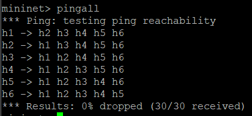

#### Ping entre h1 e h6

```bash
h1 ping -c 5 h6
```

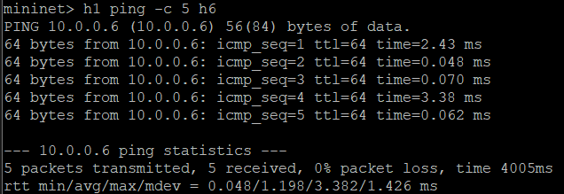

#### Ping entre h2 e h5

```bash
h2 ping -c 5 h5
```

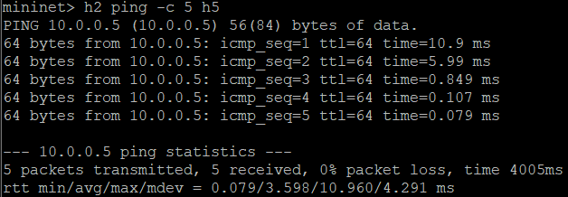

#### Ping entre h3 e h4

```bash
h3 ping -c 5 h4
```

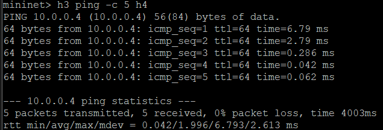

### 5. Especifique que o host 1 na porta 5555 vai ser um servidor TCP e o host 2 um cliente e execute testes de iperf, considere um relatório por segundo com teste de 15 segundos

#### Host 1: servidor TCP porta 5555 com um relatório por segundo

```bash
iperf -s -p 5555 -i 1
```

#### Host 2: cliente com 15 testes por segundo e 1 relatório por segundo

```bash
iperf -c 10.0.0.1 -p 5555 -i 1 -t 15
```

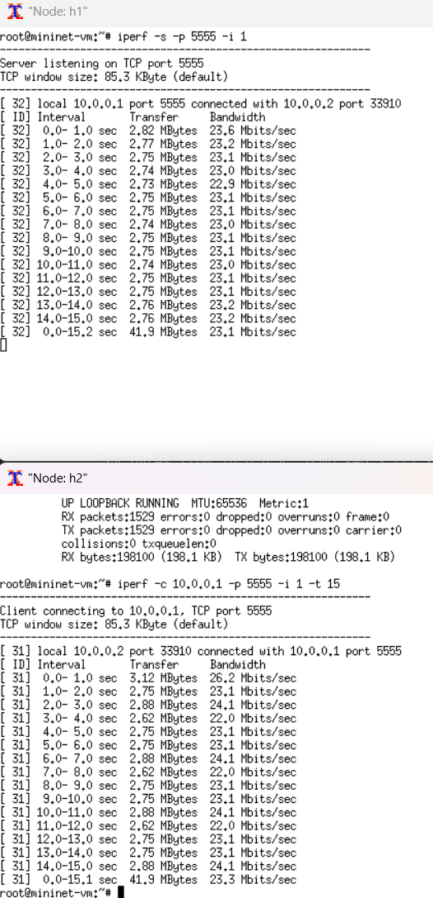
